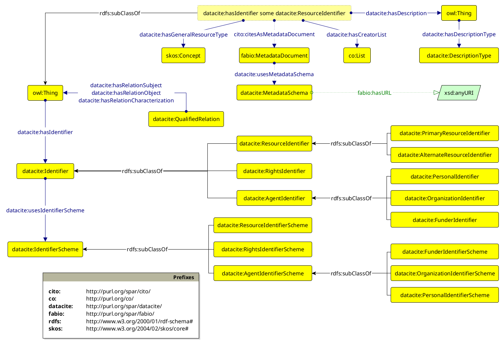

## Description

The _DataCite Ontology_ (or simply DataCite) is an ontology written in OWL 2 DL to enable the metadata properties of the [DataCite Metadata Schema (version 4.7)](https://datacite-metadata-schema.readthedocs.io/en/4.7/) to be described in RDF. 

The main intent of the DataCite Ontology is to provide a flexible mechanism to define identifiers for bibliographic resources (e.g., papers and datasets) and related entities (e.g., authors). To this end, DataCite uses the object property `datacite:hasIdentifier`, which has as its object a member of the class `datacite:Identifier` or of one of its sub-classes (`datacite:ResourceIdentifier`, `datacite:AgentIdentifier` or `datacite:RightsIdentifier`). 
In turn, `datacite:AgentIdentifier` is further sub-classed by three additional classes, i.e., `datacite:PersonalIdentifier`, `datacite:OrganizationIdentifier`, and `datacite:FunderIdentifier`. 
The exact nature of the identifier is then defined using the second DataCite object property `datacite:usesIdentifierScheme`, which has as its object the class `datacite:IdentifierScheme` or one of its sub-classes: `datacite:ResourceIdentifierScheme`, `datacite:AgentIdentifierScheme` or `datacite:RightsIdentifierScheme`. `datacite:AgentIdentifierScheme` is further sub-classed by three additional classes, i.e., `datacite:PersonalIdentifierScheme`, `datacite:OrganizationIdentifierScheme`, and `datacite:FunderIdentifierScheme`.
This provides a robust method for defining identifiers, since each specific identifier is defined as an individual member of its appropriate identifier scheme class. Of course, existing identifier schemes have been already defined within the ontology. For instance:

* `datacite:doi` is an individual member of the class `datacite:ResourceIdentifierScheme` specifying a DataCite Digital Object Identifier (DOI);
* `datacite:orcid` is an individual member of the class `datacite:PersonalIdentifierScheme` specifying an Open Researcher and Contributor Identifier (ORCID);
* `datacite:fundref` is an individual member of the class `datacite:FunderIdentifierScheme` specifying a FundRef Funder Identifier.

As need arises, new identifiers can be added later as new members of each class, without having to modify the structure of the DataCite Ontology. In addition, some members, i.e., `datacite:local-resource-identifier-scheme`, `datacite:local-personal-identifier-scheme`, `datacite:local-organization-identifier-scheme` and `datacite:local-funder-identifier-scheme`, have been already added to permit the use of local identifiers.

The class `datacite:DescriptionType`, and the object properties `datacite:hasDescription` and `datacite:hasDescriptionType`, have also been defined in order to link an entity to another item representing an entity description of a particular type. 
This is defined using the property `datacite:hasDescriptionType`, which must have as its object one of the members of the class `datacite:DescriptionType`, i.e., `datacite:abstract`, `datacite:methods`, `datacite:other`, `datacite:series-information` and `datacite:table-of-content`. 
In this way, it is possible to associate written documents (e.g. journal articles or data articles) as descriptions of datasets.

It is also possible to provide a link between a resource, such as a dataset, and the document describing its metadata by means of the _Citation Typing Ontology_ (CiTO), using the property `cito:citesAsMetadataDocument`, and the _FRBR-aligned Bibliographic Ontology_ (FaBiO), by means of the class `fabio:MetadataDocument`. 
In addition to these entities, the DataCite Ontology provides appropriate classes (i.e., `datacite:MetadataScheme`) and properties (i.e., `datacite:hasMetadataScheme`) to specify the particular scheme followed for creating the resource metadata exemplified in the metadata document.

Finally, with the DataCite Ontology, it is possible to represent situations where a given relation between two entities needs to be qualified in some way, e.g. with a description that specifies the nature of said relation.
This is provided by the class `datacite:QualifiedRelation`, which represents a certain relationship existing between two entities. 
The qualified relation is linked with one entity (more specifically, the subject of the relation) via the object property `datacite:hasRelationSubject`, and with the other (the object of the relation) via the object property `datacite:hasRelationObject`.
The type of relation itself is defined via the property `datacite:hasRelationCharacterization`, which links a qualified relation to its characterization made by using an object property such as `dcterms:relation`, `cito:cites`, or `frbr:isPartOf`. 
This usage involves [OWL2 punning](http://www.w3.org/TR/2009/WD-owl2-new-features-20090611/#F12:_Punning), a mechanism according to which an object property can be used as the object of an OWL assertion by being considered simultaneously both as a normal property and also as a named individual of the class `owl:Thing`.

## Examples of use

In the following subsections, we introduce some examples to showcase how to use the DataCite Ontology. 

The prefixes that are used in all the examples provided below are defined as follows:

    @prefix : <http://www.sparontologies.net/example/> .
    @prefix co: <http://purl.org/co/> .
    @prefix datacite: <http://purl.org/spar/datacite/> .
    @prefix dcterms: <http://purl.org/dc/terms/> .
    @prefix fabio: <http://purl.org/spar/fabio/> .
    @prefix foaf: <http://xmlns.com/foaf/0.1/> .
    @prefix literal: <http://www.essepuntato.it/2010/06/literalreification/> .
    @prefix orcid: <http://orcid.org/> .
    @prefix owl: <http://www.w3.org/2002/07/owl#> .
    @prefix rdf: <http://www.w3.org/1999/02/22-rdf-syntax-ns#> .
    @prefix rdfs: <http://www.w3.org/2000/01/rdf-schema#> .
    @prefix skos: <http://www.w3.org/2004/02/skos/core#> .
    @prefix xsd: <http://www.w3.org/2001/XMLSchema#> .

### Datasets' DOIs and authors' ORCIDs 

DataCite allows one to associate identifiers to a bibliographic entity (e.g., a dataset, a person, an article) specifying their exact nature by means of the object property `datacite:usesIdentifierScheme`. 
In addition, it is also possible, through the object property `datacite:hasDescription`, to link an entity to another item representing an entity description of a particular type. 
This is defined using the property `datacite:hasDescriptionType`, which must have as its object one of the members of the class `datacite:DescriptionType`, i.e., `datacite:abstract`, `datacite:other`, `datacite:series-information`, `datacite:methods`, and `datacite:table-of-content`. 
In this way, it is possible to associate written documents (e.g., journal articles) as descriptions of datasets.

    <http://dx.doi.org/10.5061/dryad.15v26> a fabio:Dataset ;
        datacite:hasIdentifier :dataset-doi ;
        dcterms:creator
            orcid:0000-0002-5159-9717 ,
            orcid:0000-0002-7811-3617 ;
        datacite:hasDescription
            <http://dx.doi.org/10.1098/rsbl.2015.0486> .

    <http://dx.doi.org/10.1098/rsbl.2015.0486>
        a fabio:JournalArticle ;
        datacite:hasIdentifier :paper-doi ;
        dcterms:creator
            orcid:0000-0002-5159-9717 ,
            orcid:0000-0002-7811-3617 ;
        datacite:hasDescriptionType datacite:other .

    :paper-doi a datacite:PrimaryResourceIdentifier ;
        literal:hasLiteralValue \"10.1098/rsbl.2015.0486\" ;
        datacite:usesIdentifierScheme datacite:doi .

    :dataset-doi a datacite:PrimaryResourceIdentifier ;
        literal:hasLiteralValue \"10.5061/dryad.mq8r2\" ;
        datacite:usesIdentifierScheme datacite:doi .

    orcid:0000-0002-5159-9717 a foaf:Person ;
        foaf:name \"Nidhi Seethapathi\" ;
        datacite:hasIdentifier :seethapathi-orcid .

    :seethapathi-orcid a datacite:PersonalIdentifier ;
        literal:hasLiteralValue \"0000-0002-5159-9717\" ;
        datacite:usesIdentifierScheme datacite:orcid .

    orcid:0000-0002-7811-3617 a foaf:Person ;
        foaf:name \"Manoj Srinivasan\" ;
        datacite:hasIdentifier :srinivasan-orcid .

    :srinivasan-orcid a datacite:PersonalIdentifier ;
        literal:hasLiteralValue \"0000-0002-7811-3617\" ;
        datacite:usesIdentifierScheme datacite:orcid .

### Competency Questions

The DataCite Ontology can be used for answering several questions related to related to the identification, attribution, and discoverability of research products within a scholarly knowledge graph. 
In the following subsections, some of them are introduced together with their respective SPARQL queries. 

The prefixes that are used in all the SPARQL queries provided below are defined as follows:

    PREFIX datacite: <http://purl.org/spar/datacite/>
    PREFIX dcterms: <http://purl.org/dc/terms/>
    PREFIX fabio: <http://purl.org/spar/fabio/>
    PREFIX foaf: <http://xmlns.com/foaf/0.1/>
    PREFIX literal: <http://www.essepuntato.it/2010/06/literalreification/>

#### CQ1

Which article provides the description for a specific dataset identified by the DOI \"10.5061/dryad.mq8r2\"?

    SELECT ?article ?article_doi
    WHERE {
        ?dataset_id literal:hasLiteralValue \"10.5061/dryad.mq8r2\" .
        ?dataset datacite:hasIdentifier ?dataset_id ;
            a fabio:Dataset ;
            datacite:hasDescription ?article .
        
        ?article datacite:hasIdentifier ?paper_id .
        ?paper_id literal:hasLiteralValue ?article_doi .
    }

#### CQ2

Who are the creators associated with both the dataset and the article?

    SELECT DISTINCT ?name ?orcid_uri
    WHERE {
        ?dataset a fabio:Dataset ;
                dcterms:creator ?orcid_uri .
        
        ?article a fabio:JournalArticle ;
                dcterms:creator ?orcid_uri .
                
        ?orcid_uri foaf:name ?name .
    }

#### CQ3

What are the names and ORCID iDs of all researchers mentioned in the graph?

    SELECT ?name ?orcid_value
    WHERE {
        ?person a foaf:Person ;
                foaf:name ?name ;
                datacite:hasIdentifier ?id_node .
        
        ?id_node datacite:usesIdentifierScheme datacite:orcid ;
                literal:hasLiteralValue ?orcid_value .
    }

#### CQ4

List all resources that have a description type categorized as \"other\".

    SELECT ?resource
    WHERE {
        ?resource datacite:hasDescriptionType datacite:other .
    }

#### CQ5

How many identifiers are registered for each identifier scheme?

    SELECT ?scheme (COUNT(?id_node) AS ?count)
    WHERE {
        ?id_node datacite:usesIdentifierScheme ?scheme .
    }
    GROUP BY ?scheme